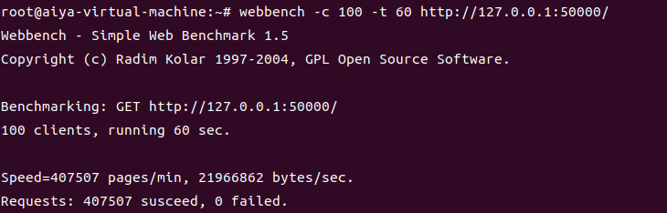
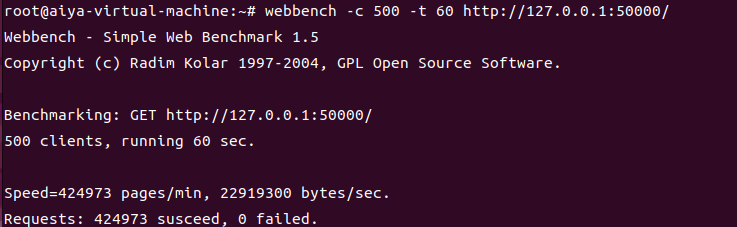
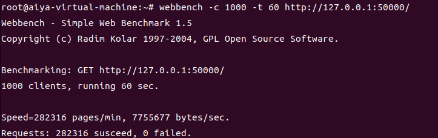
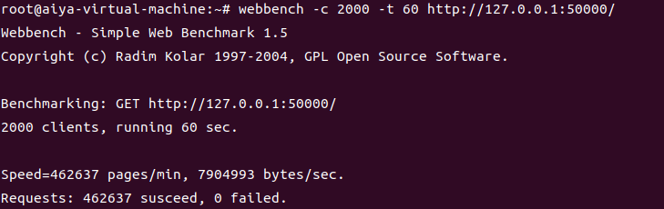
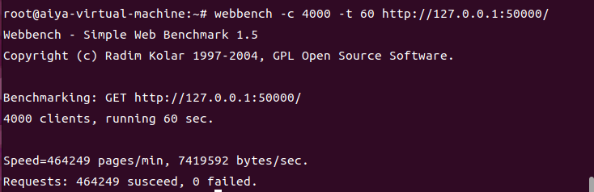
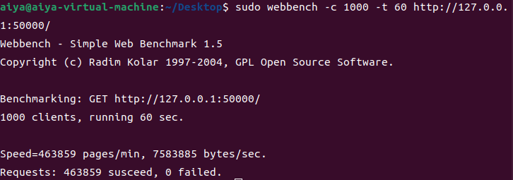

# WebServer
用C++实现的高性能WEB服务器，经过webbenchh压力测试可以实现上十万的QPS

## 功能
* 利用IO复用技术Epoll与线程池实现多线程的Reactor高并发模型；
* 利用正则与状态机解析HTTP请求报文，实现处理静态资源的请求；
* 利用标准库容器封装char，实现自动增长的缓冲区；
* 基于小根堆实现的定时器，关闭超时的非活动连接；
* 利用单例模式与阻塞队列实现异步的日志系统，记录服务器运行状态；
* 利用RAII机制实现了数据库连接池，减少数据库连接建立与关闭的开销，同时实现了用户注册登录功能。

* 增加logsys,threadpool测试单元(todo: timer, sqlconnpool, httprequest, httpresponse) 

## 环境要求
* Ubuntu 22.04.1
* C++14
* MySql 8.0.36
* Redis 6.0.16
* spdlog
* grpc
* fmt
* cppconn
* boost
* jsoncpp
* 在config.ini对应中间件配置

## 目录树

```
WebServer
├── CMakeLists.txt
├── CMakeLists.txt.user
├── CMakeLists.txt.user.3945a53
├── CMakePresets.json
├── config.ini
├── HttpConnection
│   ├── HttpConnection.cpp
│   └── HttpConnection.h
├── LogicSystem
│   ├── LogicSystem.cpp
│   └── LogicSystem.h
├── main.cpp
├── Message
│   ├── message.grpc.pb.cc
│   ├── message.grpc.pb.h
│   ├── message.pb.cc
│   └── message.pb.h
├── message.proto
├── Mysql
│   ├── MYSQLConPool.cpp
│   ├── MYSQLConPool.h
│   ├── MYSQLMgr.cpp
│   └── MYSQLMgr.h
├── Redis
│   ├── RedisMgr.cpp
│   ├── RedisMgr.h
│   └── RedisMgrPool.h
├── resources
│   ├── 400.html
│   ├── 403.html
│   ├── 404.html
│   ├── 405.html
│   ├── css
│   │   ├── animate.css
│   │   ├── bootstrap.min.css
│   │   ├── font-awesome.min.css
│   │   ├── magnific-popup.css
│   │   └── style.css
│   ├── error.html
│   ├── fonts
│   │   ├── FontAwesome.otf
│   │   ├── fontawesome-webfont.eot
│   │   ├── fontawesome-webfont.svg
│   │   ├── fontawesome-webfont.ttf
│   │   ├── fontawesome-webfont.woff
│   │   └── fontawesome-webfont.woff2
│   ├── images
│   │   ├── favicon.ico
│   │   ├── instagram-image1.jpg
│   │   ├── instagram-image2.jpg
│   │   ├── instagram-image3.jpg
│   │   ├── instagram-image4.jpg
│   │   ├── instagram-image5.jpg
│   │   └── profile-image.jpg
│   ├── index.html
│   ├── js
│   │   ├── bootstrap.min.js
│   │   ├── custom.js
│   │   ├── jquery.js
│   │   ├── jquery.magnific-popup.min.js
│   │   ├── magnific-popup-options.js
│   │   ├── smoothscroll.js
│   │   └── wow.min.js
│   ├── login.html
│   ├── picture.html
│   ├── register.html
│   ├── video
│   │   └── xxx.mp4
│   ├── video.html
│   └── welcome.html
├── Server
│   ├── GateServer
│   │   ├── WebServer.cpp
│   │   └── WebServer.h
│   └── VarifyServer
│       ├── VarifyServer.cpp
│       └── VarifyServer.h
├── Service
│   ├── AsioIOServicePool.cpp
│   └── AsioIOServicePool.h
├── SQL
│   └── my_tables.sql
└── Tool
    ├── BlockQueue.h
    ├── ConfigMgr.cpp
    ├── ConfigMgr.h
    ├── const.h
    ├── Epoller.h
    ├── Loger.h
    ├── Singleton.hpp
    └── ThreadPool.h
```

## 项目启动
需要先配置好对应的数据库
（数据库表结构和索引储存在SQL文件夹中的my_tables.sql文件）


## 压力测试

<table>
  <tbody>
    <tr>
      <td colspan="2" align="center">
        
      </td>
    </tr>
    <tr>
      <td colspan="2" align="center">
        
      </td>
    </tr>
    <tr>
      <td colspan="2" align="center">
        
      </td>
    </tr>
    <tr>
      <td colspan="2" align="center">
        
      </td>
    </tr>
    <tr>
      <td colspan="2" align="center">
        
      </td>
    </tr>
    <tr>
      <td colspan="2" align="center">
        
      </td>
    </tr>
  </tbody>
</table>
